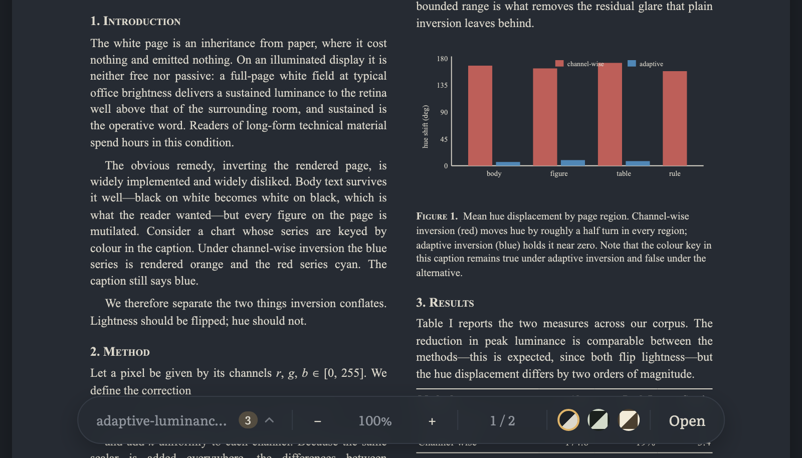
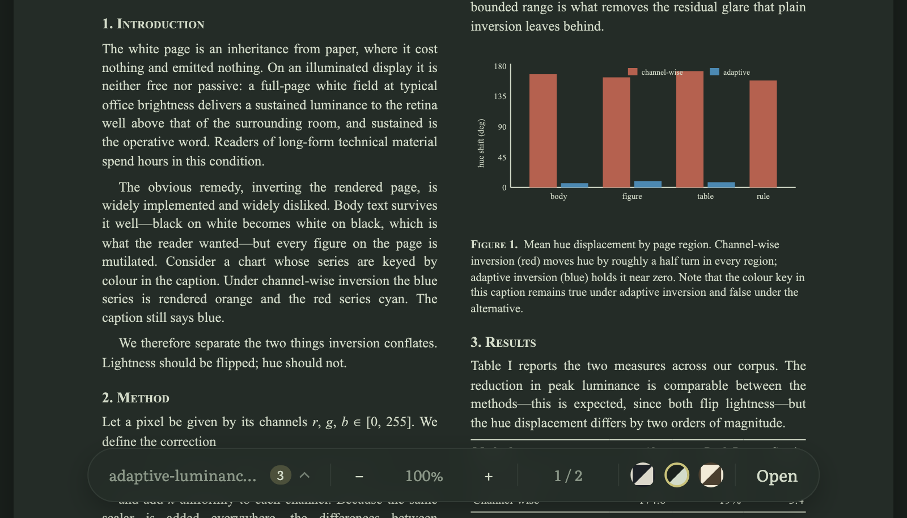
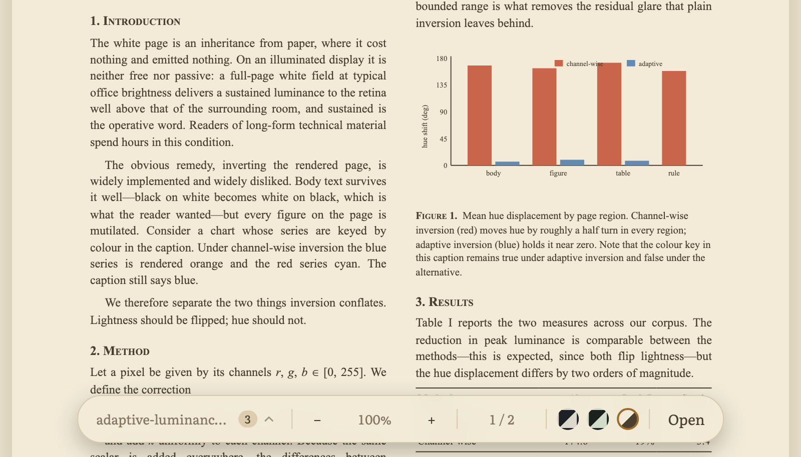

# 🪔 Lamplight

**A one-page PDF reader that redraws papers in calm, low-glare colours.**

[](LICENSE)
[](#how-to-use)
[](#how-it-works)



| Dusk | Moss | Parchment |
| :---: | :---: | :---: |
|  |  |  |
| Slate charcoal | Dark green-grey | Warm sepia |

## Why

Reading white-background PDFs on a screen — in a viewer, in VS Code, anywhere — is a small floodlight pointed at your face, and after a few papers it shows. Lamplight opens a PDF locally and re-renders every page in a quieter palette, so a long reading session stops being a squinting match. Figures keep their colours and the text stays selectable, so nothing is lost in the trade.

## Features

- **Open anything** — file picker, or drop a PDF anywhere on the page.
- **Three reading themes** — Dusk (slate charcoal), Moss (dark green-grey), Parchment (warm sepia).
- **Smart invert** — on dark themes, lightness is flipped but hue is preserved, so a blue bar in a chart stays blue.
- **Text stays text** — selectable and copyable via the pdf.js text layer, with a theme-coloured selection highlight.
- **Fast on long documents** — pages render lazily as you scroll, sharp on HiDPI screens.
- **Zoom 50–300%** — from the toolbar or with <kbd>Ctrl</kbd>/<kbd>⌘</kbd> <kbd>+</kbd> and <kbd>−</kbd>, with a live page counter.
- **Remembers you** — theme and zoom persist between visits.
- **Private by design** — the file is read in your browser and never uploaded anywhere.
- **Considerate** — friendly errors, visible keyboard focus, responsive layout, respects `prefers-reduced-motion`.

## How to use

**Online:** visit `https://<username>.github.io/<repo>/`

**Locally:** download `index.html` and open it in your browser. That's the whole install — there is nothing to build and nothing to `npm install`.

Then choose a PDF or drag one onto the window, and pick a theme from the toolbar at the bottom.

### Keyboard shortcuts

| Keys | Action |
| :--- | :--- |
| <kbd>Ctrl</kbd>/<kbd>⌘</kbd> + <kbd>+</kbd> | Zoom in |
| <kbd>Ctrl</kbd>/<kbd>⌘</kbd> + <kbd>−</kbd> | Zoom out |
| <kbd>Tab</kbd> | Move through the toolbar controls |
| <kbd>Space</kbd>, <kbd>↑</kbd> <kbd>↓</kbd>, <kbd>Page Up/Down</kbd> | Scroll the document (ordinary browser scrolling) |

## How it works

pdf.js renders each page to a canvas, and Lamplight then rewrites the pixels before they reach your eyes.

On the dark themes this is a *smart invert* rather than a plain one. For each pixel it computes

```
k = 255 − max(r, g, b) − min(r, g, b)
```

and adds `k` to all three channels. That flips lightness while leaving the relationship between channels — the hue — intact, which is why charts and figures survive the trip. The result is then mapped linearly onto the theme's background→text colour range, so nothing lands on pure black or pure white; the Parchment theme uses the same mapping without the inversion.

Pages are observed with an `IntersectionObserver` and rendered just before they scroll into view, at `devicePixelRatio` (capped at 2.5) for crispness, and fit to the window width up to 900px.

## Privacy

Your PDF never leaves your machine. It is read with the browser's `File` API, decoded in the tab, and drawn to a canvas — there is no server, no upload, no analytics. The only network requests Lamplight makes are for pdf.js and the Literata font, both from public CDNs, the first time you load the page.

## Limitations

- Scanned (image-only) PDFs have no selectable text — they recolour fine, but there is nothing to select.
- Very large PDFs recolour page by page as you scroll, so expect a brief pause on each new page.
- The first load needs an internet connection to fetch pdf.js and the font.

## Roadmap

- Remember the last-read page per document
- Custom theme colours
- Offline / PWA support
- Search within the document

## Contributing

Ideas, bug reports and small patches are all welcome — see [CONTRIBUTING.md](CONTRIBUTING.md).

## Deploying your own copy

GitHub Pages will serve this repo as-is:

1. **Settings → Pages**
2. Under **Build and deployment**, set **Source** to *Deploy from a branch*
3. Choose the `main` branch and the `/ (root)` folder, then **Save**

Your copy appears at `https://<username>.github.io/<repo>/` within a minute or two.

## License

[MIT](LICENSE).

## Acknowledgements

- [pdf.js](https://mozilla.github.io/pdf.js/) by Mozilla (Apache-2.0) does all the hard work of decoding PDFs.
- [Literata](https://fonts.google.com/specimen/Literata) by Google Fonts, a typeface designed for long-form reading.
