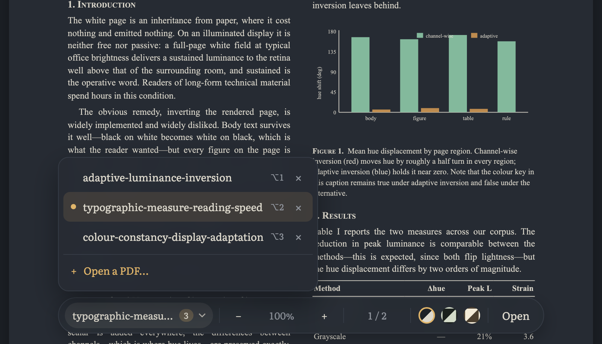

# 🪔 Lamplight

**A one-page PDF reader that redraws papers in calm, low-glare colours.**

[](LICENSE)
[](#how-to-use)
[](#how-it-works)


| Dusk | Moss | Parchment |
| :---: | :---: | :---: |
|  |  |  |
| Slate charcoal | Dark green-grey | Warm sepia |

Open as many papers as you like and switch between them from the toolbar:



## Why

Reading white-background PDFs on a screen — in a viewer, in VS Code, anywhere — is a small floodlight pointed at your face, and after a few papers it shows. Lamplight opens a PDF locally and re-renders every page in a quieter palette, so a long reading session stops being a squinting match. Figures keep their colours and the text stays selectable, so nothing is lost in the trade.

## Features

- **Open anything** — file picker, or drop PDFs anywhere on the page.
- **Many documents at once** — open a stack of papers and switch between them from the toolbar. Each one remembers where you were reading.
- **Three reading themes** — Dusk (slate charcoal), Moss (dark green-grey), Parchment (warm sepia).
- **Smart invert** — on dark themes, lightness is flipped but hue is preserved, so a blue bar in a chart stays blue.
- **Text stays text** — selectable and copyable via the pdf.js text layer, with a theme-coloured selection highlight.
- **Fast on long documents** — pages render lazily as you scroll, sharp on HiDPI screens.
- **Zoom 50–300%** — from the toolbar or with <kbd>Ctrl</kbd>/<kbd>⌘</kbd> <kbd>+</kbd> and <kbd>−</kbd>.
- **Jump to any page** — the page counter is editable: click it, type a number, press <kbd>Enter</kbd>. No scrolling through a hundred pages to reach page 94.
- **Remembers you** — theme and zoom persist between visits; scroll position persists per document.
- **Private by design** — the file is read in your browser and never uploaded anywhere.
- **Considerate** — friendly errors, visible keyboard focus, responsive layout, respects `prefers-reduced-motion`.

## How to use

**Online:** <https://vasu021.github.io/Lamplight/>

**Locally:** download `index.html` and open it in your browser. That's the whole install — there is nothing to build and nothing to `npm install`.

Then choose a PDF or drag one onto the window — drop several at once if you like — and pick a theme from the toolbar at the bottom.

To go straight to a page, click the page counter in the middle of the toolbar, type the number and press <kbd>Enter</kbd> — numbers outside the document are clamped to its first or last page, so a mistyped 999 lands on the end rather than doing nothing.

With more than one document open, the filename on the left of the toolbar becomes a switcher: it shows how many are open, and clicking it lists them. Pick one to jump to it, press <kbd>×</kbd> to close it, or **Open a PDF…** to add another. Opening a file you already have open just takes you back to it rather than loading a second copy.

### Keyboard shortcuts

| Keys | Action |
| :--- | :--- |
| <kbd>Ctrl</kbd>/<kbd>⌘</kbd> + <kbd>+</kbd> | Zoom in |
| <kbd>Ctrl</kbd>/<kbd>⌘</kbd> + <kbd>−</kbd> | Zoom out |
| <kbd>Enter</kbd> *(in the page counter)* | Jump to the page you typed |
| <kbd>↑</kbd> <kbd>↓</kbd> *(in the page counter)* | Step forward / back one page |
| <kbd>Esc</kbd> *(in the page counter)* | Cancel and go back to the current page |
| <kbd>Alt</kbd>/<kbd>⌥</kbd> + <kbd>1</kbd>…<kbd>9</kbd> | Jump to the *n*th open document |
| <kbd>Alt</kbd>/<kbd>⌥</kbd> + <kbd>←</kbd> <kbd>→</kbd> | Previous / next document (wraps) |
| <kbd>Esc</kbd> | Close the document switcher |
| <kbd>Tab</kbd> | Move through the toolbar controls |
| <kbd>Space</kbd>, <kbd>↑</kbd> <kbd>↓</kbd>, <kbd>Page Up/Down</kbd> | Scroll the document (ordinary browser scrolling) |

The document shortcuts use <kbd>Alt</kbd>/<kbd>⌥</kbd> rather than <kbd>Ctrl</kbd>/<kbd>⌘</kbd> because <kbd>⌘</kbd><kbd>Tab</kbd> and <kbd>⌘</kbd><kbd>W</kbd> belong to the browser and the operating system.

## How it works

pdf.js renders each page to a canvas, and Lamplight then rewrites the pixels before they reach your eyes.

On the dark themes this is a *smart invert* rather than a plain one. For each pixel it computes

```
k = 255 − max(r, g, b) − min(r, g, b)
```

and adds `k` to all three channels. That flips lightness while leaving the relationship between channels — the hue — intact, which is why charts and figures survive the trip. The result is then mapped linearly onto the theme's background→text colour range, so nothing lands on pure black or pure white; the Parchment theme uses the same mapping without the inversion.

Pages are observed with an `IntersectionObserver` and rendered just before they scroll into view, at `devicePixelRatio` (capped at 2.5) for crispness, and fit to the window width up to 900px.

Every open document keeps its own page list, observer and scroll position; only the active one is in the layout, so the documents you aren't reading cost nothing to keep around. Changing theme or zoom marks all of them stale at once, and each re-renders lazily the next time you look at it.

## Privacy

Your PDF never leaves your machine. It is read with the browser's `File` API, decoded in the tab, and drawn to a canvas — there is no server, no upload, no analytics. The only network requests Lamplight makes are for pdf.js and the Literata font, both from public CDNs, the first time you load the page.

## Limitations

- Scanned (image-only) PDFs have no selectable text — they recolour fine, but there is nothing to select.
- Very large PDFs recolour page by page as you scroll, so expect a brief pause on each new page.
- The first load needs an internet connection to fetch pdf.js and the font.
- Open documents live in memory for the session. A dozen large PDFs at once will use a lot of it, and closing a document is what gives it back.

## Roadmap

- Custom theme colours
- Offline / PWA support
- Search within the document, and across open documents
- Reopen the last session's documents

## Contributing

Ideas, bug reports and small patches are all welcome — see [CONTRIBUTING.md](CONTRIBUTING.md).

## Deploying your own copy

GitHub Pages will serve this repo as-is:

1. **Settings → Pages**
2. Under **Build and deployment**, set **Source** to *Deploy from a branch*
3. Choose the `main` branch and the `/ (root)` folder, then **Save**

Your copy appears at `https://<username>.github.io/<repo>/` within a minute or two — for this repo, <https://vasu021.github.io/Lamplight/>.

## License

[MIT](LICENSE).

## Acknowledgements

- [pdf.js](https://mozilla.github.io/pdf.js/) by Mozilla (Apache-2.0) does all the hard work of decoding PDFs.
- [Literata](https://fonts.google.com/specimen/Literata) by Google Fonts, a typeface designed for long-form reading.
